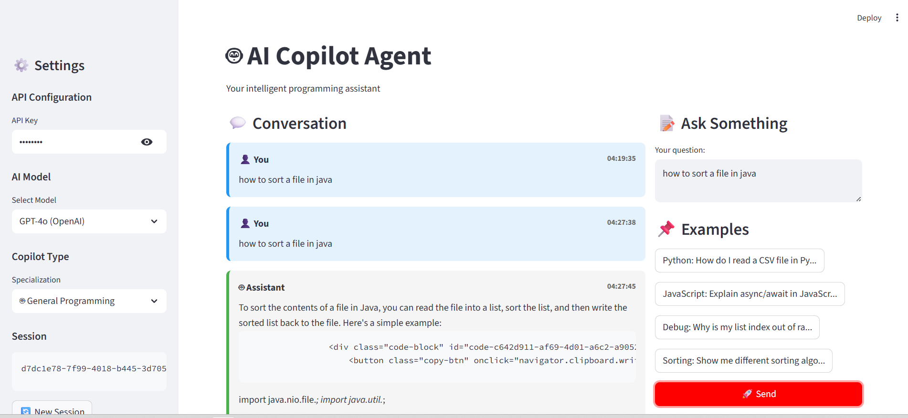

# 🚀 AI Copilot Agent


## 📋 Table of Contents
- [Overview](#overview)
- [System Architecture](#system-architecture)
- [Features](#features)
- [Technology Stack](#technology-stack)
- [Project Structure](#project-structure)
- [Installation](#installation)
- [Configuration](#configuration)
- [Usage](#usage)
- [API Endpoints](#api-endpoints)
- [Dependencies](#dependencies)
- [Contributing](#contributing)
- [License](#license)

## 🎯 Overview

**AI Copilot Agent** is a powerful programming assistant that helps developers with coding questions, debugging, and code examples. It leverages local LLMs (like Deepseek-Coder) through Ollama, with optional support for cloud-based models (OpenAI GPT-4, Claude). The system features conversation memory, rate limiting, specialized copilots, and a beautiful Streamlit interface.

## 🏗 System Architecture

```
┌─────────────────────────────────────────────────────────────────────┐
│                        AI COPILOT AGENT                              │
│                      Programming Assistant                            │
└─────────────────────────────────────────────────────────────────────┘

                              🧑💻 USER
                                 │
                                 ▼
┌─────────────────────────────────────────────────────────────────────┐
│                         FRONTEND (Streamlit 1.28.1)                  │
│  ┌─────────────────────────────────────────────────────────────┐    │
│  │                    🤖 AI Copilot                             │    │
│  │  ┌─────────────────────────────────────────────────────┐    │    │
│  │  │  Ask me something about programming:                │    │    │
│  │  │  └─────────────────────────────────────────────┘   │    │    │
│  │  │  [How do I sort a list in Python?]                  │    │    │
│  │  │                                                     │    │    │
│  │  │              ┌────────┐                             │    │    │
│  │  │              │ Send 📤 │                             │    │    │
│  │  │              └────────┘                             │    │    │
│  │  ├─────────────────────────────────────────────────────┤    │    │
│  │  │              💬 CONVERSATION HISTORY                 │    │    │
│  │  │  ┌─────────────────────────────────────────────┐    │    │    │
│  │  │  │  👤 You (14:30): How do I sort in Python?   │    │    │    │
│  │  │  │                                              │    │    │    │
│  │  │  │  🤖 Assistant (14:31):                       │    │    │    │
│  │  │  │  Use the sort() method or sorted() function: │    │    │    │
│  │  │  │                                              │    │    │    │
│  │  │  │  📋 Copy ┌─────────────────────┐           │    │    │    │
│  │  │  │          │ my_list = [3,1,4,2] │           │    │    │    │
│  │  │  │          │ my_list.sort()      │           │    │    │    │
│  │  │  │          └─────────────────────┘           │    │    │    │
│  │  │  └─────────────────────────────────────────────┘    │    │    │
│  │  └─────────────────────────────────────────────────────┘    │
│  └─────────────────────────────────────────────────────────────┘
                                 │
                                 │ HTTP POST (JSON) :8000
                                 │ {"prompt": "How do I sort..."}
                                 ▼
┌─────────────────────────────────────────────────────────────────────┐
│                    BACKEND API (FastAPI 0.104.1)                     │
│                                                                      │
│  ┌─────────────────────────────────────────────────────────────┐    │
│  │                     MIDDLEWARE LAYER                          │    │
│  │  ┌─────────────┐  ┌─────────────┐  ┌─────────────┐          │    │
│  │  │   CORS      │  │    Rate     │  │    Auth     │          │    │
│  │  │  Middleware │  │  Limiting   │  │ (JWT/PyJWT) │          │    │
│  │  └─────────────┘  └─────────────┘  └─────────────┘          │    │
│  │                                                              │    │
│  │  ┌─────────────────────────────────────────────────────┐    │    │
│  │  │                 ENDPOINTS LAYER                       │    │    │
│  │  │  ┌─────────────────────────────────────────────┐    │    │    │
│  │  │  │  POST /copilot        POST /copilot/python  │    │    │    │
│  │  │  │  POST /copilot/js      POST /copilot/debug  │    │    │    │
│  │  │  │  GET  /health          GET  /history/{id}   │    │    │    │
│  │  │  └─────────────────────────────────────────────┘    │    │    │
│  │  └─────────────────────────────────────────────────────┘    │    │
│  │                                                              │    │
│  │  ┌─────────────────────────────────────────────────────┐    │    │
│  │  │                 SERVICE LAYER                         │    │    │
│  │  │                                                      │    │    │
│  │  │    ┌──────────────┐    ┌──────────────┐            │    │    │
│  │  │    │  Conversation│    │    Cache     │            │    │    │
│  │  │    │    Manager   │    │   Manager    │            │    │    │
│  │  │    └──────────────┘    └──────────────┘            │    │    │
│  │  │                                                      │    │    │
│  │  │    ┌──────────────┐    ┌──────────────┐            │    │    │
│  │  │    │    Rate      │    │   Response   │            │    │    │
│  │  │    │   Limiter    │    │  Formatter   │            │    │    │
│  │  │    └──────────────┘    └──────────────┘            │    │    │
│  │  └─────────────────────────────────────────────────────┘    │    │
│  │                                                              │    │
│  │  ┌─────────────────────────────────────────────────────┐    │    │
│  │  │                  AI MODEL LAYER                       │    │    │
│  │  │                                                      │    │    │
│  │  │    ┌─────────────────────────────────────────┐      │    │    │
│  │  │    │           Model Selector                │      │    │    │
│  │  │    └─────────────────────────────────────────┘      │    │    │
│  │  │           │            │            │               │    │    │
│  │  │           ▼            ▼            ▼               │    │    │
│  │  │  ┌─────────────┐ ┌─────────────┐ ┌─────────────┐   │    │    │
│  │  │  │   Local     │ │   OpenAI    │ │   Claude    │   │    │    │
│  │  │  │   Models    │ │   Models    │ │   Models    │   │    │    │
│  │  │  │ Deepseek-   │ │  GPT-4      │ │  Claude-3   │   │    │    │
│  │  │  │ coder       │ │  GPT-3.5    │ │  Opus       │   │    │    │
│  │  │  └─────────────┘ └─────────────┘ └─────────────┘   │    │    │
│  │  └─────────────────────────────────────────────────────┘    │    │
│  └─────────────────────────────────────────────────────────────┘    │
│                                 │                                    │
│                                 ▼                                    │
└─────────────────────────────────────────────────────────────────────┘
                           │
                    ┌──────┴──────┐
                    │             │
                    ▼             ▼
┌─────────────────────────┐  ┌─────────────────────────┐
│     IN-MEMORY STORAGE    │  │    OLLAMA (LOCAL)       │
│  ┌─────────────────────┐  │  │  ┌─────────────────────┐  │
│  │ • Conversation      │  │  │  │ • deepseek-coder    │  │
│  │   History           │  │  │  │ • Cache             │  │
│  │ • Cache             │  │  │  │ • Rate Limiting     │  │
│  │ • Rate Limiting     │  │  │  │   Data              │  │
│  │   Data              │  │  │  └─────────────────────┘  │
│  └─────────────────────┘  │  └─────────────────────────┘
└─────────────────────────┘  └─────────────────────────┘
```

## ✨ Features

- **🤖 Multiple AI Models**: Support for local (Deepseek-coder, Llama) and cloud (GPT-4, Claude) models
- **💬 Conversation Memory**: Remembers context across multiple questions
- **🚀 Specialized Copilots**: Python expert, JavaScript expert, Debugging assistant
- **⚡ Rate Limiting**: Prevents API abuse (60 requests/minute)
- **💾 Response Caching**: Reduces redundant API calls
- **📝 Code Highlighting**: Beautiful syntax highlighting in responses
- **📋 Copy to Clipboard**: One-click code copying
- **🔐 Authentication**: API key-based security
- **📊 Session Management**: Multiple conversation sessions
- **🩺 Health Monitoring**: Built-in health checks




## 🛠 Technology Stack

### Backend
| Technology | Version | Purpose |
|------------|---------|---------|
| **FastAPI** | 0.104.1 | High-performance web framework for APIs |
| **Uvicorn** | 0.24.0 | ASGI server for FastAPI |
| **Python-dotenv** | 1.0.0 | Environment variable management |
| **Nest-asyncio** | 1.5.8 | Async support in Jupyter notebooks |
| **PyJWT** | 2.10.1 | JWT authentication |
| **Python-multipart** | 0.0.9 | Form data parsing |
| **Passlib** | 1.7.4 | Password hashing |
| **Bcrypt** | 4.0.1 | Password encryption |
| **HTTPX** | 0.27.2 | Async HTTP client for API calls |

### AI Models
| Technology | Version | Purpose |
|------------|---------|---------|
| **OpenAI** | 2.20.0 | GPT-4 and GPT-3.5 integration |
| **Anthropic** | 0.7.7 | Claude AI integration |
| **Ollama** | Latest | Local model management |
| **Deepseek-coder** | Latest | Code-specialized local LLM |

### Frontend
| Technology | Version | Purpose |
|------------|---------|---------|
| **Streamlit** | 1.28.1 | Rapid UI development |
| **Requests** | 2.31.0 | HTTP client for API calls |

### Optional (for production)
| Technology | Purpose |
|------------|---------|
| **Redis** | Production-grade caching and rate limiting |
| **Docker** | Containerization |
| **PostgreSQL** | Persistent storage |

## 📁 Project Structure

```
ai-copilot-agent/
│
├── 📂 backend/
│   ├── 📄 main.py                 # FastAPI application entry point
│   ├── 📄 requirements.txt        # Python dependencies
│   ├── 📄 .env                    # Environment variables
│   │
│   └── 📂 models/
│       ├── 📄 __init__.py
│       ├── 📄 openai_model.py     # OpenAI GPT integration
│       ├── 📄 claude_model.py     # Claude AI integration
│       └── 📄 local_model.py      # Ollama local models
│
├── 📂 frontend/
│   ├── 📄 app.py                  # Streamlit UI application
│   └── 📄 requirements.txt        # Frontend dependencies
│
├── 📄 docker-compose.yml           # Docker configuration
├── 📄 README.md                    # Project documentation
└── 📄 .gitignore                   # Git ignore file
```

## 📦 Installation

### Prerequisites
- Python 3.12+
- Ollama (for local models)
- Git

### Step 1: Clone the Repository
```bash
git clone https://github.com/yourusername/ai-copilot-agent.git
cd ai-copilot-agent
```

### Step 2: Set Up Backend
```bash
# Navigate to backend folder
cd backend

# Create virtual environment
python -m venv venv

# Activate virtual environment
# On Windows:
venv\Scripts\activate
# On Mac/Linux:
source venv/bin/activate

# Install dependencies
pip install -r requirements.txt
```

### Step 3: Set Up Frontend
```bash
# Open new terminal, navigate to frontend folder
cd frontend

# Install frontend dependencies
pip install -r requirements.txt
```

### Step 4: Install and Configure Ollama
```bash
# Download and install Ollama from https://ollama.ai

# Pull code-specific models
ollama pull deepseek-coder:latest
ollama pull codellama

# Verify installation
ollama list
```

### Step 5: Configure Environment Variables
Create `.env` file in the backend folder:
```env
# API Keys (optional - for cloud models)
OPENAI_API_KEY=your_openai_key_here
ANTHROPIC_API_KEY=your_anthropic_key_here

# Local Model Configuration
LOCAL_MODEL_NAME=deepseek-coder:latest
OLLAMA_URL=http://localhost:11434
MODEL_TEMPERATURE=0.2
MODEL_MAX_TOKENS=2048
MODEL_CONTEXT_LENGTH=8192

# Rate Limiting
RATE_LIMIT=60
```

## 🚀 Usage

### Start the Backend Server
```bash
# Terminal 1
cd backend
venv\Scripts\activate  # or source venv/bin/activate on Mac/Linux
python main.py
# Server runs at http://localhost:8000
```

### Start Ollama (if not running)
```bash
# Terminal 2
ollama serve
```

### Start the Frontend
```bash
# Terminal 3
cd frontend
streamlit run app.py
# UI available at http://localhost:8501
```

### Using the Application

1. **Open browser** at `http://localhost:8501`
2. **Select model** from sidebar:
   - `local` - Deepseek-coder (default)
   - `gpt4` - OpenAI GPT-4 (requires API key)
   - `gpt35` - OpenAI GPT-3.5
   - `claude` - Claude AI
3. **Choose copilot type**:
   - General Programming
   - Python Expert
   - JavaScript Expert
   - Debugging Expert
4. **Ask programming questions**!
5. **Copy code** with one click

## 🌐 API Endpoints

| Endpoint | Method | Description | Auth Required |
|----------|--------|-------------|---------------|
| `/copilot` | POST | General programming assistant | Yes |
| `/copilot/python` | POST | Python specialist | Yes |
| `/copilot/javascript` | POST | JavaScript specialist | Yes |
| `/copilot/debug` | POST | Debugging specialist | Yes |
| `/health` | GET | Health check | No |
| `/history/{session_id}` | GET | Get conversation history | Yes |
| `/history/{session_id}` | DELETE | Clear conversation history | Yes |

### API Request Example
```json
POST /copilot
{
    "prompt": "How do I sort a list in Python?",
    "session_id": "user123",
    "model": "local"
}
```

### API Response Example
```json
{
    "response": "Use the sort() method or sorted() function...",
    "cached": false,
    "model": "local",
    "copilot_type": "general",
    "session_id": "user123"
}
```

## 📚 Dependencies Deep Dive

### Why These Dependencies?

#### Backend Framework
- **FastAPI**: Chosen for its automatic OpenAPI documentation, high performance (on par with Node.js), and built-in validation using Pydantic
- **Uvicorn**: Lightning-fast ASGI server that supports async/await

#### AI Integration
- **OpenAI 2.20.0**: Latest SDK with full support for GPT-4 and GPT-3.5 Turbo, includes streaming capabilities
- **Anthropic 0.7.7**: Official Claude SDK with support for Claude 3 models
- **Ollama**: Zero-configuration local model management, no API keys needed

#### Security
- **PyJWT 2.10.1**: Industry standard for stateless authentication
- **Passlib + Bcrypt**: Secure password hashing with multiple rounds of encryption

#### Performance
- **Redis 5.0.1**: (Optional) In-memory data store for caching and rate limiting
- **HTTPX**: Async HTTP client that supports both HTTP/1.1 and HTTP/2

#### Development
- **Python-dotenv**: Secure environment variable management
- **Nest-asyncio**: Enables running asyncio in Jupyter notebooks

## 🤝 Contributing

Contributions are welcome! Here's how you can help:

1. Fork the repository
2. Create a feature branch (`git checkout -b feature/amazing-feature`)
3. Commit changes (`git commit -m 'Add amazing feature'`)
4. Push to branch (`git push origin feature/amazing-feature`)
5. Open a Pull Request

### Development Guidelines
- Follow PEP 8 style guide
- Add tests for new features
- Update documentation
- Use type hints

## 📄 License

This project is licensed under the MIT License - see the LICENSE file for details.

## 🙏 Acknowledgments

- OpenAI for GPT models
- Anthropic for Claude
- Ollama team for local model management
- Deepseek for the excellent coder model
- FastAPI and Streamlit communities

## 📧 Contact

For questions or support, please open an issue on GitHub.

---

**Made with ❤️ for developers everywhere**
